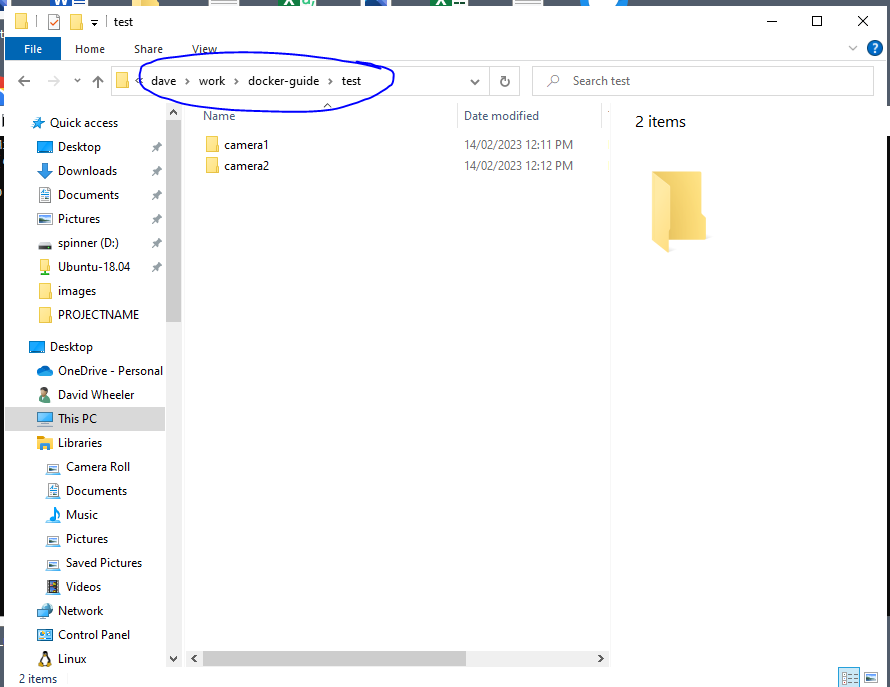
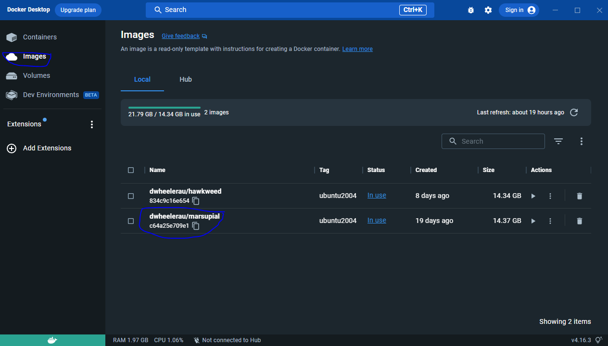
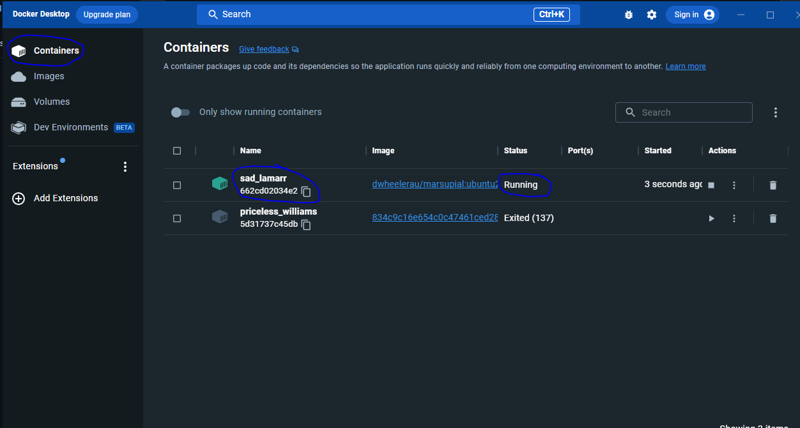

# Marsupial-contained
A docker image of marsupial.ai for aussie-centric camera trap data automation. If you are new to docker I've created a [guide](https://github.com/dwheelerau/docker-guide) for running these on windows.  

## Introduction  
This repo creates a docker image that allows users to run [Marsupial.au](https://github.com/Sydney-Informatics-Hub/marsupial) in a system agnostic way. I have also created a `prediction_batch.py` script that batch processes images contained in a target directory. The script also creates a CSV file of output information and automatically generates images with BBOX information for trouble shooting. Some more information about my marsupial.ai fork can be found [here](https://github.com/dwheelerau/marsupial.git).    

[Marsupial.au](https://github.com/Sydney-Informatics-Hub/marsupial) is a camera trap processing pipeline based on [megadetector v5](https://github.com/microsoft/CameraTraps) that was developed by the [Sydney Uni data hub](https://github.com/Sydney-Informatics-Hub). 

The current model descriptions from the authors are shown below (these can be specified by `-m /build/marsupial/weights/MODEL_FILENAME.pt`). The `marsupial_72s.pt` is the default model.  

marsupial_detector: This model is a pure animal detector, and simply finds any animal in an image.  
marsupial_16s: This model can identify 16 species of animal, with extremely high precision and recall.  
marsupial_33s: This model can identify 33 species, with very high precision and recall.  
marsupial_41s: This model can identify 41 species, and is a great balance between pure performance and detailed predictions.  
marsupial_72s: This model can identify 72 species, and is our most detailed predictor while still delivering stare of the art performance.  

If you use this script you should cite the marsupial.au paper as well as Megadetector!The citation for megadetector itself is:  
```
@article{beery2019efficient,
  title={Efficient Pipeline for Camera Trap Image Review},
  author={Beery, Sara and Morris, Dan and Yang, Siyu},
  journal={arXiv preprint arXiv:1907.06772},
  year={2019}
}
```
**ToDo:** find masupial.ai citation.    

## How is Marsupial.ai different from megadetector  
- animal detection as well as classification for common animals found in Australia
- trained on the wild count dataset from NSW Parks
- authors claim that the latest model can reliably detect 72 species

# Quickstart

## Process camera trap images through masupial.ai (with GPU support)  
Use the file explore navigate to the directory where your images are stored (ie Desktop\images etc). In the file path bar (circled below)
type `cmd` to open a command prompt in this current directory.  



Next we pull the megadetector image from docker, copy and paste or type the following at the command prompt.  
If you copy the command you can paste it by right clicking on the top border of the command prompt terminal window. 

```
docker pull dwheelerau/marsupial:ubuntu2004
```

The download should begin and a message will be printed when the it is complete. Return to the Docker Desktop app and click on the "images" tag on the 
left hand side of the screen (see below), the new image `dwheelerau/marsupial` should be listed.  



The next steps will create a container from the image, and we will use this container to process our camera trap images.  

Back in the windows terminal window type (or copy/paste) the following command (**note** if you have a nvidia
GPU on your computer read on for the command that will utilise this resource for 10x faster image processing):  
```
docker run -it -d -v %cd%:/project dwheelerau/marsupial:ubuntu2004 /bin/bash
```
If you have a GPU the command is slightly different, use the `--gpus all` switch to make that available.  

```
docker run -it -d --gpus all -v %cd%:/project dwheelerau/marsupial:ubuntu2004 /bin/bash
```

The above command creates a container in `-d` detacted mode and mounts our current working directory (this is why we opened our terminal from this folder)
inside the container (FYI the Linux mount path is `/project`.  

Returning back to the Docker Desktop app, click on the "container" tab on the left hand side of the GUI. You should see a container with the image
tag of `dwheelerau/marsupial`. Note the "Name", in the example below this is `sad_lamarr`, we use this name to run commands on the container. The status
should also be showing "running", if it isn't just click the play button in the "Actions" section.  

  

We can confirm all of this using the terminal by typing `docker ps -a`, which should print out the available containers.  

Now we are ready to execute a command. The following will:  
1) Launch a new job in the container called  `sad_lamarr` (note yours will be called something different, so you need to replace this name with the name from
the docker desktop or from the `docker ps -a` command)  
2) process images in a folder in our current working directory called "TEST_INPUT" (note it will also process any images it finds inside this folder)  
3) create a spreadsheet (XLSX) file of the results in our current working directory  
4) create images with boundary boxes in a new folder called "OUTPUT"

You can change the paths to the input images and output images by chang the `-i` and `-o` switches in the following command:  

```
docker exec -it sad_lamarr /bin/bash -c "cd /project && python /build/marsupial/prediction_batch.py -i TEST_INPUT -m /build/marsupial/weights/marsupial_72s.pt -o OUTPUT"
``` 

If everything works the progress should be printed to screen inside the terminal. You can run or re-run the command as many times as you like, as long 
as the container is still running (see next).  

Finally, when you are done, it is best to shutdown the containers as they will be consuming system resources. The easiest way is just to hit the 
stop button in the "Actions" section of the docker desktop container page. The container should indicate that it is now "exited".  

Some additional details about the python scripts under the hood our detailed below (FYI).  

# Additional detail that might be of interest

The main script `prediction_batch.py` script generats a `prediction.csv` file of results (bbox information, detection class, detection probabilities), and copies of the images with bboxes added (these are saved in the directory specified by `-o`). The `-i` directory is required (ie the target directory with images you want to process). The other options can be left as defaults are provided.

You can run commands on the container directly without first starting it using the following syntax.  
```
docker run --gpus all -it -v %cd%:/project dwheelerau/marsupial:ubuntu2004 /bin/bash -c "cd /project && python /build/marsupial/prediction_batch.py -i /build/marsupial/data -m /build/marsupial/weights/marsupial_72s.pt -o processed_images"
```

Or if you are using Linux (or WSL).  
```
# -o output directory for bbox images
sudo docker run --gpus all -it -v `pwd`:/project dwheelerau/marsupial:ubuntu2004 /bin/bash -c "cd /project && python /build/marsupial/prediction_batch.py -i /build/marsupial/data -m /build/marsupial/weights/marsupial_72s.pt -o processed_images"
```

## Creating the image and running the container
The following is not required if you pulled the container from the docker hub (above).  

To build this file:  

```
sudo docker build -f Dockerfile . -t dwheelerau/marsupial:ubuntu2004
```

The following Mounts your current host directory in the container directory,
at /project, and runs the `prediction_batch.py` script with demo settings.  

 
```
sudo docker run --gpus all -it -v `pwd`:/project dwheelerau/marsupial:ubuntu2004 /bin/bash -c "cd /project && python /build/marsupial/prediction_batch.py -i /build/marsupial/data -m /build/marsupial/weights/marsupial_72s.pt -o processed_images"
```
